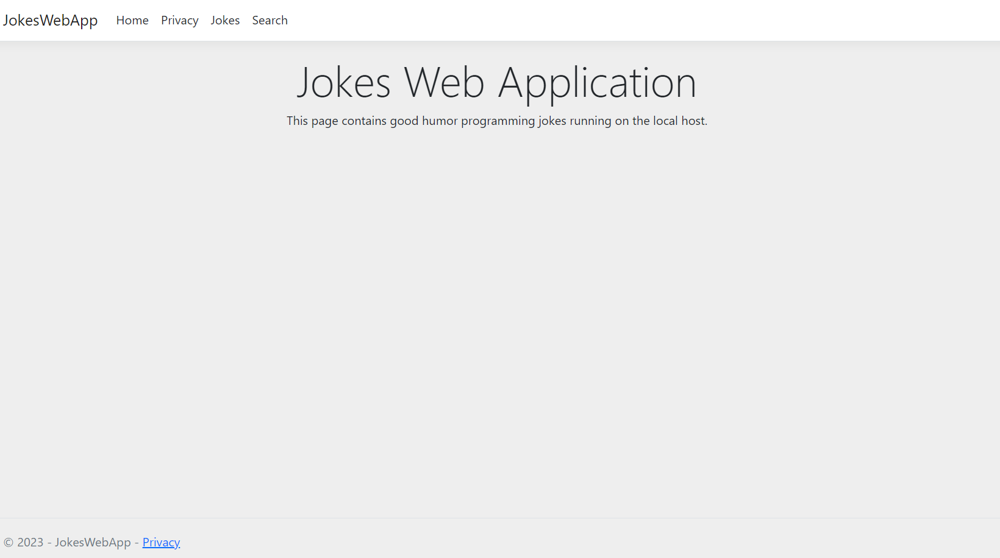

# Programming Jokes Web App
The Jokes Repository contains a web database app in ASP.NET Core using Visual Studio and the C# language. By combining ASP.NET Core, C#, and Visual Studio, the Jokes Repository delivers a user-friendly web database application. Whether you are a user seeking humor or an administrator managing jokes, the Jokes Repository is designed to provide an enjoyable and efficient experience, making it a go-to resource for laughter and entertainment.

The Jokes Repository utilizes the Model-View-Controller (MVC) architectural pattern to structure and organize its codebase. MVC is a widely adopted design pattern that promotes separation of concerns and modularity in web application development.

